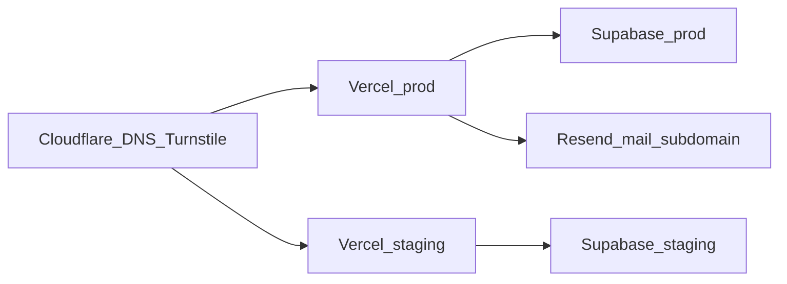

# KCMI Digital Platform — Architecture V1

**Status:** APPROVED — PHASE B FOUNDATION AUTHORIZED  
**Authority:** Accepted ADRs in `docs/DECISIONS/` plus explicit Phase B implementation authorization (2026-09-07).  
**Production deployment:** NOT authorized by this document.  
**Historical draft:** [`ARCHITECTURE_V1_DRAFT.md`](ARCHITECTURE_V1_DRAFT.md) retained for continuity; **new implementation references this file**.  
**Standards:** OWASP ASVS 5.0 **Level 2** (selective stronger controls as warranted); WCAG 2.2 AA; NIST SSDF-aligned practices — **ACCEPTED** (ADR-0001).

### Phase B product/design confirmations (ACCEPTED)

- **Events root:** `events.kcmi-rcc.org/` is an **Events home/index** (featured, upcoming, archived)—**not** an automatic redirect. Specific events use stable slugs. `camp.kcmi-rcc.org` may later redirect to the applicable active camp slug.
- **Authoritative brand primitives (do not replace via JPEG sampling):** off-white `#eff5f5`, red `#b60b13`, green `#108c1d`, lavender `#c298b7`, violet `#7c1963`. No invented gold/other brand colors without approval. Semantic tokens must meet WCAG; lavender needs dark text; green must not be assumed safe with white for normal-size text.

### Evidence labels

| Label | Meaning |
|-------|---------|
| **VERIFIED CURRENT STATE** | Confirmed from Phase 0 inventory or inspected legacy/camp source |
| **ACCEPTED** | Decided by human architecture review and recorded in an ADR |
| **PROPOSED** | Recommended detail not elevated to its own ADR (may refine in implementation within ACCEPTED bounds) |
| **DECISION REQUIRED** | Still needs explicit human approval |
| **EXTERNAL VERIFICATION REQUIRED** | Cannot be confirmed from this repository alone |

### Accepted ADR index

| ADR | Topic | Status |
|-----|-------|--------|
| [ADR-0001](DECISIONS/ADR-0001-target-stack-and-hosting.md) | Target stack and hosting | ACCEPTED |
| [ADR-0002](DECISIONS/ADR-0002-event-hostname-and-routing.md) | Event hostname and routing | ACCEPTED |
| [ADR-0003](DECISIONS/ADR-0003-authentication-mfa-authorization.md) | Auth, MFA, authorization | ACCEPTED |
| [ADR-0004](DECISIONS/ADR-0004-sensitive-data-storage-retention.md) | Sensitive data, storage, retention | ACCEPTED |
| [ADR-0005](DECISIONS/ADR-0005-public-forms-bot-protection.md) | Public forms and bot protection | ACCEPTED |
| [ADR-0006](DECISIONS/ADR-0006-content-publishing-and-giving-dual-approval.md) | Content publishing and giving dual approval | ACCEPTED |
| [ADR-0007](DECISIONS/ADR-0007-livestream-facebook-model.md) | Livestream (Facebook) model | ACCEPTED |
| [ADR-0008](DECISIONS/ADR-0008-ai-trust-boundary.md) | AI trust boundary (V1) | ACCEPTED |

---

## 1. Product scope

### In scope (ACCEPTED direction)

1. **Public website** for KCMI / Rehoboth Christian Center (information, sermons metadata via YouTube, giving display, contact, locations, **Facebook** livestream presentation).
2. **Events platform** on **`events.kcmi-rcc.org`** for camps, conferences, conventions—reusable slugs; not a new repository per program (ADR-0002).
3. **KCMI Hub** for approved non-technical staff operations with MFA, RLS, pastoral separation, and audit.

### Out of scope for V1

- Line-by-line port of legacy HTML/JS.
- Custom password storage.
- Prisma (unless a later ADR).
- Cloudflare R2 (unless a later ADR with demonstrated need).
- Experimental passkeys as MFA foundation.
- AI beyond draft-assist (ADR-0008).
- PDF payment evidence; third-party malware scanner for receipts (ADR-0004).
- Facebook Graph API auto live-status (ADR-0007).
- Break-glass pastoral access (ADR-0003) unless separately approved.
- Third-party APM/error vendor (ADR-0001) unless native observability proves insufficient.
- HSTS preload (ADR-0001).

### Legacy constraint

**VERIFIED CURRENT STATE:** Legacy stack is static `public/` HTML/CSS/TS, Express on Render, MySQL livestream table, Google Sheets/Calendar/Maps, camp submodule at `camp.kcmi-rcc.org`, Cloudinary public receipt URLs, Google Forms, reCAPTCHA.  
**ACCEPTED:** Rebuild ground-up beside legacy; preserve approved content, URLs, workflows, branding; keep legacy available until controlled cutover; redirect `camp.kcmi-rcc.org` to the applicable camp event slug on `events.kcmi-rcc.org`.

---

## 2. User personas

| Persona | Goals | Label |
|---------|-------|-------|
| Public visitor / seeker | Find services, locations, Facebook livestream, contact | PROPOSED (persona naming) |
| Member | Sermons (YouTube), programs, giving, events | PROPOSED |
| Event registrant | Register, upload image payment evidence, confirmation email | ACCEPTED capabilities |
| Media administrator | Publish programs/media/sermons — **no** pastoral narratives | ACCEPTED |
| Branch administrator | Branch address/schedule/contacts | ACCEPTED direction |
| Registrar | Event registrations | ACCEPTED direction |
| Finance reviewer | Private payment evidence; dual-approval for giving config | ACCEPTED |
| Pastor | Assigned pastoral cases only (permission + assignment) | ACCEPTED |
| Pastoral administrator | Queues, assignments, retention extensions with reason | ACCEPTED |
| Super administrator | Platform administration — **not** automatic pastoral read | ACCEPTED |
| Auditor | Read-only audit views | ACCEPTED direction |

---

## 3. Administrative roles and permissions

### Stable roles (ACCEPTED)

| Role | Intent |
|------|--------|
| `super_admin` | Platform administration (**not** automatic pastoral narrative access) |
| `pastoral_admin` | Pastoral queues; assign cases; documented retention extensions |
| `pastor` | Assigned cases with explicit pastoral permissions |
| `media_admin` | **HQ Content Admin** in the initial operating model ([OPERATING_MODEL.md](OPERATING_MODEL.md)): public CMS for HQ and all branches, including livestream. **No** pastoral narratives, `users.manage`, or `giving.change`. |
| `branch_admin` | Branch records, **assignment-scoped**. Dormant until leadership wants decentralized logins. |
| `registrar` | Event registrations |
| `finance_reviewer` | Payment evidence review; giving dual-approval participant |
| `auditor` | Read-only audit / compliance |

### Fine-grained permissions (ACCEPTED examples)

- `prayer.read`, `prayer.assign`
- `counselling.read`, `counselling.assign`
- `welfare.read`, `welfare.assign`
- `programs.create`, `programs.publish`
- `sermons.manage`
- `events.manage`
- `registrations.manage`
- `payment_evidence.review`
- `giving.change`
- `users.manage`
- `livestream.manage`
- `branches.manage`
- `audit.read`

### Mechanisms (ACCEPTED)

- `role_permissions`, `user_roles`, `pastoral_assignments`
- Enforcement: server + **RLS**; UI is not a security boundary
- Claims may assist UX; DB/RLS authoritative for sensitive revocation
- Pastoral access requires **explicit pastoral permission** even for Super Admin

**VERIFIED CURRENT STATE (anti-pattern):** Legacy UI JWT + unauthenticated livestream POST — must not recur.

---

## 4. Functional requirements

See [REQUIREMENTS.md](REQUIREMENTS.md). Summary aligned to ADRs:

- Hub content, sermons (YouTube), branches, events, Facebook livestream settings
- Engagement submissions; pastoral requests with separation
- Event registration + private image payment evidence (JPEG/PNG/WebP ≤ 5 MB)
- Dual approval for public giving destination changes
- Gradual first-party forms replacing Google Forms (schemas EXTERNAL VERIFICATION REQUIRED per workflow)
- Draft-assist AI only if introduced (ADR-0008)

---

## 5. Non-functional requirements

| Area | Target | Label |
|------|--------|-------|
| Security verification | ASVS 5.0 Level 2 (+ selective stronger) | ACCEPTED |
| Accessibility | WCAG 2.2 AA | ACCEPTED |
| Secure development | NIST SSDF-aligned practices | ACCEPTED |
| Performance | Image-first; budgets in §15 | PROPOSED metrics (refine in testing) |
| Privacy | Pastoral isolation; private receipts; safe notifications | ACCEPTED |
| Observability | Platform-native + uptime; no PII/pastoral/receipts/secrets in logs | ACCEPTED |

---

## 6. Content model

### Workflow (ACCEPTED direction)

**Draft → Preview → Publish → Archive** for Hub-managed publishable content.  
Version history/rollback for important editable content: **ACCEPTED** architectural intent.

### Giving configuration (ACCEPTED — ADR-0006)

Maker-checker / dual approval before publishing public giving bank-account / payment destination changes. Both actors: appropriate permission + **AAL2**.  
Routine event payment-evidence verification does **not** require dual approval in V1.

### Privacy / Terms (ACCEPTED — ADR-0006)

Privacy Policy and Terms **body content remain code-controlled** for V1 (not Media Admin editable).

### Code-controlled vs Hub-controlled (ACCEPTED / PROPOSED detail)

| Code-controlled | Hub-controlled |
|-----------------|----------------|
| Design tokens, layout shells | Programs, announcements, flyers, placement |
| Privacy / Terms bodies (V1) | Sermon metadata + YouTube URL |
| AuthZ migrations | Branches, events, registrations |
| Security headers / budgets | Engagement + pastoral queues (permissioned) |
| | Facebook livestream URL + `is_live` |
| | Giving values under dual-approval |

---

## 7. Data classification

See [DATA_CLASSIFICATION.md](DATA_CLASSIFICATION.md) (updated with ACCEPTED retention defaults).

---

## 8. Proposed database entities and relationships

### Sensitivity boundaries (ACCEPTED — ADR-0004)

- `engagement_submissions` — first_timer | fellowship | service_team
- `pastoral_requests` — prayer | counselling | welfare
- `pastoral_assignments`, `pastoral_messages`, `pastoral_case_notes`
- `events`, `event_registrations`, `payment_evidence`
- Content: programs/announcements, sermons, branches, media_assets
- `profiles`, `user_roles`, `role_permissions`
- `giving_accounts` + dual-approval workflow tables
- `livestream_settings` — `facebook_url`, `is_live`, `updated_by`, `updated_at` (ADR-0007)
- `audit_events`, `content_revisions`
- Retention configuration store (central, migration/config driven)

**Why isolate pastoral data:** Blast-radius reduction; RLS clarity; retention/AI exclusion; confidentiality.

**Google Form schemas:** EXTERNAL VERIFICATION REQUIRED before each replacement workflow’s final columns — does **not** block unrelated foundation/public-site work (ADR-0005).

---

## 9. Authentication architecture

| Topic | Decision | Label |
|-------|----------|-------|
| IdP | Supabase Auth | ACCEPTED |
| Custom passwords | None | ACCEPTED |
| MFA | TOTP for **all** Hub staff; enroll in onboarding | ACCEPTED |
| High-impact actions | Require **AAL2** session | ACCEPTED |
| Passkeys | Not V1 dependency | ACCEPTED |
| Session | Expiration, logout/revocation, disabled accounts | ACCEPTED intent |

**VERIFIED CURRENT STATE:** Legacy `AD_USER`/`AD_PASS` + weak livestream protection.

---

## 10. Authorization / RLS strategy

**ACCEPTED (ADR-0003):** Deny by default; media cannot SELECT pastoral narratives; pastors need permission + assignment; Super Admin ≠ pastoral read; service-role server-only; positive+negative RLS tests required.

---

## 11. Storage architecture

**ACCEPTED (ADR-0004 / ADR-0001):**

| Class | Use |
|-------|-----|
| Public bucket | Approved published marketing/media only |
| Private bucket | Payment evidence and approved sensitive files |

Payment evidence: JPEG/PNG/WebP; 5 MB max; no PDF; size + MIME + signature checks; random object names; short-lived signed access; no permanent public URLs; no separate malware vendor in V1.  
R2 deferred.

---

## 12. Public-form security design

**ACCEPTED (ADR-0005):** Cloudflare **Turnstile** + server rate limiting; no reCAPTCHA in new architecture.  
Schema validation server-side; CSRF per platform patterns; notifications without sensitive narratives.  
**VERIFIED CURRENT STATE:** Legacy reCAPTCHA — do not carry forward as the new default.

Google Forms gradual replacement with purpose-limited historical migration (ADR-0005).

---

## 13. Event-platform architecture

**ACCEPTED (ADR-0002):**

- Host: `events.kcmi-rcc.org`
- Slugs: e.g. `/camp-2027`, `/ministers-conference-2027`
- **Root `/` is an Events home/index** (featured, upcoming, archived)—not an automatic redirect
- `camp.kcmi-rcc.org` may later redirect to the applicable active camp slug (vanity/legacy)
- Prefer `next.config` host rewrites → real `/events/...` routes
- No `proxy.ts` unless proven necessary later
- Route groups = layout organization only

**EXTERNAL VERIFICATION REQUIRED:** Exact DNS record values at provisioning time.

Transactional confirmation email via **Resend** (ADR-0001).

---

## 14. KCMI Hub information architecture

**PROPOSED** nav labels under real `/admin` routes:

Dashboard; Programs & announcements; Media; Sermons; Branches; Events & registrations; Payment evidence; Engagement inbox; Pastoral inbox (permissioned); Giving (dual-approval); Livestream (Facebook URL + live toggle); Users & roles; Audit.

---

## 15. Media performance strategy and budgets

**VERIFIED CURRENT STATE:** Multi‑MB eager hero video on home.

**ACCEPTED direction:** Image-first; video never mandatory for first paint; defer large video on mobile; respect reduced-motion / save-data where feasible; use intrinsic dimensions / aspect-ratio / Next Image correctly (not arbitrary fixed layout widths).

### Proposed measurable budgets (refine via testing) — PROPOSED

| Metric / asset | Proposed budget |
|----------------|-----------------|
| LCP | ≤ 2.5s (mobile p75) |
| INP | ≤ 200ms |
| CLS | ≤ 0.1 |
| Initial JS transfer | ≤ 200 KiB |
| Initial CSS | ≤ 50 KiB |
| Hero/poster | ≤ 200 KiB |
| Fonts | ≤ 100 KiB |
| Third-party scripts first load | ≤ 50 KiB unless justified |
| Total critical first-load transfer | ≤ 1.5 MiB |

---

## 16. Accessibility strategy

**ACCEPTED:** WCAG 2.2 AA.

**Authoritative brand primitives (ACCEPTED — human-supplied; do not re-derive from JPEG):** `#eff5f5`, `#b60b13`, `#108c1d`, `#c298b7`, `#7c1963`. Also present in legacy CSS (**VERIFIED CURRENT STATE**). Use primitive + semantic tokens; enforce WCAG contrast (lavender → dark text; do not assume green+white for normal text).

---

## 17. SEO strategy and legacy URL preservation

**VERIFIED CURRENT STATE:** Canonicals on many pages; no robots/sitemap in repo; youth-camp redirects to camp host.

**ACCEPTED / PROPOSED:** Preserve primary paths; add sitemap/robots; map camp vanity → events slug; maintain redirect checklist from inventory.

---

## 18. Audit logging and revision strategy

**ACCEPTED intent:** Immutable audit for privileged actions (roles, giving publish, livestream, pastoral admin actions, AI-assisted approvals). No pastoral narratives or receipt bytes in audit payloads. Content revisions for rollback. Retention of audit metadata: 24 months default (ADR-0004).

---

## 19. Backup / recovery approach

**ACCEPTED direction:** Supabase backups/PITR per selected plan — **EXTERNAL VERIFICATION REQUIRED** at provisioning. Ownership in OWNERSHIP_REGISTER (no secrets). Auditable deletion jobs; retention holds honored (ADR-0004).

---

## 20. Observability

**ACCEPTED (ADR-0001):** Platform-native Vercel, Supabase, Cloudflare + uptime checks. No third-party APM in V1 unless native insufficient (new ADR). Never send pastoral narratives, payment evidence, or credentials to observability systems.

---

## 21. Automated testing strategy

**ACCEPTED intent:** Unit; RLS allow/deny; a11y; e2e for publish, registration+evidence authZ, pastoral isolation, giving dual-approval, MFA/AAL2 gates, livestream URL allowlist. Never claim unrun tests.

---

## 22. CI / release gates

**PROPOSED:** lint, typecheck, unit+RLS, build; e2e on protected branches. Production deploy only with explicit human instruction.

---

## 23. Staging / production topology

**ACCEPTED stack placement:** Cloudflare DNS → Vercel (prod/staging) → Supabase (separate projects) → Resend; Turnstile on public forms.



**EXTERNAL VERIFICATION REQUIRED:** Legacy Vercel/Cloudflare project binding details; production DNS cutover plan timing.

---

## 24. Migration sequence from legacy website

See [MIGRATION_PLAN.md](MIGRATION_PLAN.md).

**ACCEPTED:** Gradual Forms replacement; purpose-limited historical import; camp vanity redirect to events slug; private re-home of payment evidence (no public Cloudinary URLs). Forms schema gaps do not block unrelated Phase B/C work.

---

## 25. Rollback strategy

**PROPOSED operational:** DNS back to legacy; keep legacy deploy during soak; forward-fix new DB migrations.

---

## 26. Service-account / ownership migration

**ACCEPTED operating model:** Church-owned identities; named admins + backups; no shared passwords; secrets not in Git ([OWNERSHIP_REGISTER.md](OWNERSHIP_REGISTER.md)).  
**EXTERNAL VERIFICATION REQUIRED:** Current personal vs church ownership of live accounts.

---

## 27. Cost-bearing services and unsafe free-tier assumptions

| Service | Note | Label |
|---------|------|-------|
| Supabase prod | Avoid free-tier sleep assumptions for Hub/pastoral SLAs | ACCEPTED caution |
| Auth MFA / MAU | Confirm pricing at provision | EXTERNAL VERIFICATION REQUIRED |
| Resend | Volume + domain auth | EXTERNAL VERIFICATION REQUIRED at setup |
| Turnstile | Quotas | EXTERNAL VERIFICATION REQUIRED |
| Storage egress | Monitor | PROPOSED |

**VERIFIED CURRENT STATE:** Legacy `/api/db-keepalive` pattern indicates free-tier DB risk — do not repeat as architecture.

---

## 28. Architectural decisions — status

### Resolved (ACCEPTED ADRs)

Stack/hosting; events hostname + camp vanity redirect; MFA all staff + AAL2; RBAC model; giving dual approval; Forms migration direction; Turnstile; payment evidence rules; Storage; Privacy/Terms code-controlled; retention defaults; observability; HSTS without preload; AI draft-only; Resend; Facebook livestream model; ASVS L2.

### Remaining DECISION REQUIRED

1. ~~Explicit Phase B build authorization~~ — **RESOLVED** (Phase B foundation authorized; production deploy still not authorized).
2. ~~Events root redirect vs index~~ — **RESOLVED** (Events home/index with featured/upcoming/archived).
3. **Whether/when to introduce Proxy** — only if rewrite spike fails (document concrete gap); CSP nonce approach may require a spike report (Phase B).
4. **Exact Resend from-addresses** and mail subdomain finalization at provisioning (direction ACCEPTED; values later).
5. **Break-glass pastoral access** — not V1; future ADR if ever required.
6. **Expand AI beyond draft-assist** — future security review + ADR.
7. **HSTS preload** — future ADR after subdomain/recovery verification.
8. **Third-party APM** — only if native observability insufficient (new ADR).
9. **R2 adoption** — only with demonstrated need (new ADR).
10. **PDF receipts or malware vendor** — only via new ADR if policy changes.

### Remaining EXTERNAL VERIFICATION REQUIRED

- Google Forms field schemas (per workflow, before that workflow’s implementation)
- Production/staging DNS records and provider project bindings
- Supabase backup/PITR tier capabilities after plan selection
- Final CSP allowlists (YouTube sermons + Facebook embeds) against running app and current provider docs
- Auth/storage/email/Turnstile pricing and quotas
- Current account ownership (personal vs church)
- Logo pixel sampling vs brand hex (CSS consistency already verified)
- Live Sheet/Cloudinary inventories if migrating historical camp data

---

## 29. Security threats and mitigations

| Threat | Mitigation | Label |
|--------|------------|-------|
| Unauthenticated privileged writes | AuthZ + RLS + MFA/AAL2 | ACCEPTED |
| Pastoral IDOR | Permission + assignment + RLS | ACCEPTED |
| Public receipts | Private storage + signed URLs; image-only V1 | ACCEPTED |
| XSS via embed HTML | Store Facebook URL only; controlled renderer | ACCEPTED |
| Bot/abuse | Turnstile + rate limits | ACCEPTED |
| AI overreach | ADR-0008 draft-only boundary | ACCEPTED |
| Secret leakage | Server-only secrets; no service-role in browser | ACCEPTED |

### Security headers baseline (ACCEPTED intent)

CSP (avoid broad `unsafe-inline`; allowlist YouTube for sermons and Facebook for livestream embeds deliberately); HSTS **without** preload initially; `X-Content-Type-Options`; `Referrer-Policy`; `Permissions-Policy`; CSP `frame-ancestors`. Final CSP strings: EXTERNAL VERIFICATION REQUIRED at implementation.

### Session / application security (ACCEPTED intent)

Session expiration; logout/revocation; disabled staff; invitation/onboarding; MFA enrollment; server authorization; CSRF considerations; rate limiting; Turnstile; brute-force protection; audit trails.

---

## 30. Phase-by-phase implementation roadmap

| Phase | Work | Notes |
|-------|------|-------|
| **A** | Governance + ADRs | Done for accepted decisions |
| **B** | Foundation: Next.js/Supabase/Auth MFA/RLS/headers/CI/Turnstile wiring | Requires **explicit build authorization**; not blocked by Forms schemas |
| **C** | Public site, performance, SEO/redirects | May proceed without pastoral form schemas |
| **D** | Hub content, sermons, branches, livestream | |
| **E** | Engagement + pastoral forms | Per-workflow schema EXTERNAL VERIFICATION |
| **F** | Events host, registration, private evidence, camp vanity redirect | |
| **G** | Cutover, ownership register complete, legacy decommission | Explicit human instruction |

---

## Appendix A — Route structure (real URLs)

**ACCEPTED / PROPOSED tree detail:**

```text
app/
  (site)/                 # layout only — not a URL segment
    page.tsx
    about/ sermons/ giving/ locations/ contact/ ...
  events/
    [slug]/page.tsx      # /events/[slug]; also via events host rewrite
  admin/
    ...
```

`events.kcmi-rcc.org/:path*` → `/events/:path*` via `next.config` host rewrites (ADR-0002).

---

## Appendix B — AI trust boundary

See ADR-0008 (ACCEPTED). Draft-assist only; human publish; no pastoral access by default; no superuser; untrusted output; auditable approvals.

---

## Appendix C — Giving configuration control

See ADR-0006 (ACCEPTED). Dual approval + AAL2 for public giving destination changes. Not required for routine payment-evidence review in V1.

---

## Appendix D — Livestream (Facebook)

See ADR-0007 (ACCEPTED). Normalize/validate Facebook URL; manual `is_live`; `livestream.manage` + audit; sermons remain YouTube.

---

## Appendix E — Phase B authorization

**Phase B foundation implementation is AUTHORIZED** under this approved architecture and the explicit Phase B instruction. Work is isolated under `platform/`. **Production deployment remains NOT authorized.**

**Still required before production cutover / pastoral-form / camp-data migration:** EXTERNAL VERIFICATION items in §28 (schemas, DNS, backups tier, CSP finalize, ownership, pricing).

---

*End of Architecture V1 (APPROVED — Phase B foundation authorized).*
